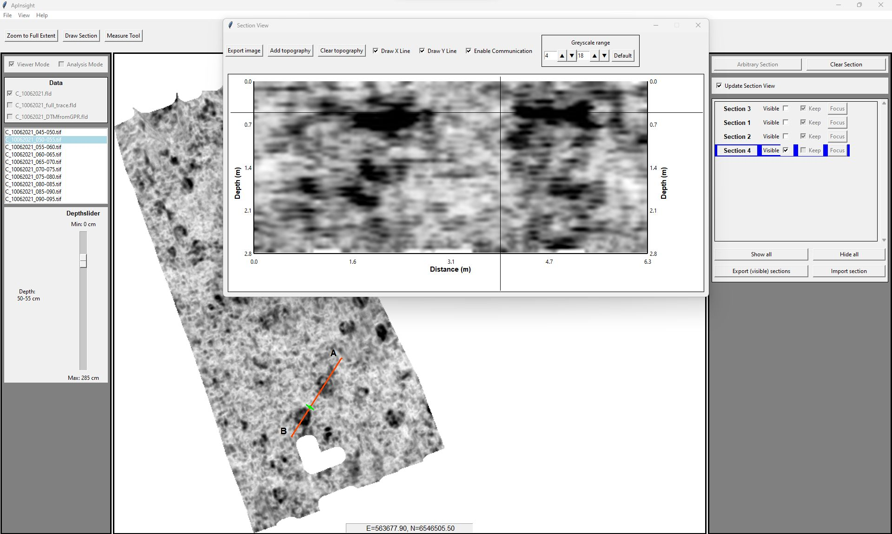

# ApInsight
### Ground Penetrating Radar Data Analysis Tool

## Overview
ApInsight is a Python-based tool designed for analyzing and visualizing ground penetrating radar (GPR) data, particularly tailored for use with already processed 3D data blocks in the .fld file format. This format is exclusively created by the ApRadar software, developed by Geosphere Austria. ApInsight encompasses a suite of scripts for data visualization and analysis, enabling users to interpret GPR data with higher efficiency and accuracy. To facilitate exploration and understanding of its functionality, a sample dataset (https://github.com/erichnau/ApInsight-SampleData) is available in a separate repository, allowing interested individuals to engage with the tool's capabilities. It is compatible with both Windows and Linux operating systems. 

## Features
- **Graphical User Interface:** Offers an intuitive layout for easy navigation and interaction.
- **Project File Management:** Simplifies project setup, data handling, and management through various GUI components. Enables creation of project files in .json format containing links to necessary files and folders.
- **Data preprocessing:** Provides functions to create depth-slice images from .fld files and preprocess .fld files for fast visualization.
- **Depthslice Viewer:** Allows access to all depth-slice images defined in a project file, enabling simple switching between different datasets.
- **Measurement Tool:** Facilitates measurement of distances and areas on depth-slice images.
- **Drawing Tool:** Enables drawing, storing, and viewing of section lines on depth-slice images. Section lines can be stored in the project file and exported/imported to/from .shp files, allowing for interoperability with GIS software.
- **Section Tool:** Extracts arbitrary vertical sections through a chosen dataset along drawn section lines. Facilitates communication between the depth-slice viewer and section view for detailed data analysis. Allows for the export of section images as .png files.

## Installation

### Prerequisites
- Clone the repository or download the source code.
- Ensure that Python 3.9 (or greater) is installed on your system. Download the latest version here: https://www.python.org/downloads/
- Recommended: Use a Python IDE like Pycharm Community Edition: https://www.jetbrains.com/pycharm/download/?section=windows
- Install the required libraries listed in 'requirements.txt' by running **'pip install -r requirements.txt'**

A short introduction video (for people new to Python) showing the setup of your Python environment to run ApInsight can be found here: https://www.youtube.com/watch?v=f0AKAc0pgbo

## Usage
To start the application run **'main.py'** and the main window will open. All features are accessible through the main window. 
The use of ApInsight is very intuitive and a detailed user guide can be found here: **link to youtube video**

## Contributing
Contributions to ApInsight are welcome. Please ensure that any contributions follow the existing code structure and do not break existing functionality.

## License
The software is released under the MIT License. See the LICENSE file for more details.

## Acknowledgements
This project was made possible through the support of the Norwegian Institute for Cultural Heritage Research ([NIKU](https://www.niku.no)). The strategic funding pot of NIKU, financed by the Norwegian Research Council, played a crucial role in facilitating the development of ApInsight.
Gratitude is extended to [Geosphere Austria](https://www.geosphere.at/de) for their financial contribution, which aided the progression and enhancement of this project.
Special recognition goes to Alois Hinterleitner from Geosphere Austria, the original programmer of ApRadar. His assistance in understanding and handling the custom .fld file format was greatly appreciated.

A special thanks to [Markus Angermann](https://www.angermann.at/)  for his invaluable contributions as a programming consultant. His expertise and insights have been instrumental in refining and advancing of ApInsight.

